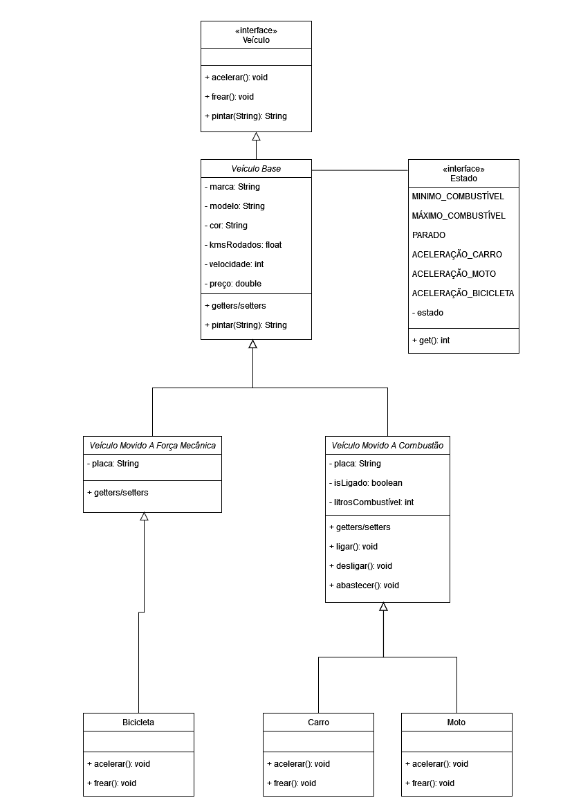

# Desafio de Orientação a Objetos

Exercícios para treinar Programação Orientada a Objetos.

## Exercício 01

Implementado com o padrão de projeto Composite.

### Testes executados pela classe TesteVeiculo:

* Testando se o carro tem combustivel para acelerar
* Testando capacidade do limite maximo de combustivel
* Testando frenagem do veiculo
* Testando a cor do veiculo
* Testando ligacao do carro

## Exercício 02

Eu segui as especificações do exercício, separando as classes e interfaces em packages distintos. Para printar os logs em métodos que haviam retorno, como 'calculaImposto', eu fiz um print antes do retorno.

**NOTA:** Eu sei que muitos outros já avisaram, mas é sempre bom lembrar, o print do calculaImposto do ps4 está no pdf como 450, sendo que o correto é 810 pelo valor de 45%, então eu deixei dessa forma, com imposto de 45%.

## Exercício 03

Segui o mesmo padrão do exercício 02, de separar as classes em packages distintos, além de sobreescrever o método toString para melhor visualização das mudanças quando um personagem sobre de nível. Também está entendível quando ocorre um ataque, entretanto não printei o valor aleatório, somente o resultado.

## Exercício 04, 05 e 06

Como esses exercícios usam com a mesma classe Pessoa, eu simplesmente coloquei eles em uma classe Exercicios.java e transformei eles em métodos.
### 04 - imprimirNomePessoaMaisVelha
Usa duas variáveis, uma para idade e outra para o objeto Pessoa. Ao procurar na List<Pessoa> e quando encontra algum objeto Pessoa com o atributo idade maior que outro objeto Pessoa, atribui o valor da idade e o objeto Pessoa as respectivas variáveis. Quando a busca termina, é impresso o objeto Pessoa com maior idade.
### 05 - excluirPessoasMenorDeDezoito
Utiliza uma List<Pessoa> para armazenar todos objetos Pessoa com atributo idade menor que 18. Após adicionar todos esses objetos a essa lista, eles então são excluídos da lista original.
### 06 - exibirIdadePessoaNaLista 
Percorre a lista procurando pelo nome, ao encontrar imprime a idade.

## Exercício 07

Bonificação eu transformei em uma interface que é implementada na classe pai Funcionario. Por fim editei o toString para ficar compreensível o print no console.

# Observações
Não sei o que aconteceu com o eclipse, mas não consegui criar um package para cada exercício e packages adicionais em cada exercício. Então, eu criei um projeto Java para cada exercício, espero que não tenha problema. 
Outro detalhe é que o tentei configurar o eclipse para apresentar os caracteres especiais quando printamos no console, como 'ç' e '´', entretanto ele não surtiu efeito, logo, palavras que usam esses caracteres eu não os usei. Por exemplo, 'Senhor dos Anéis' ficou 'Senhor dos Aneis'. 